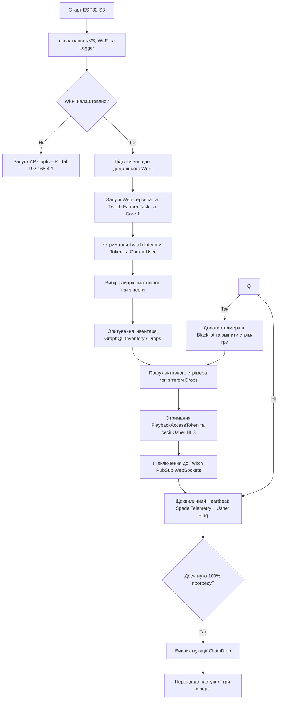

# 🎮 ESP32-S3 Twitch Drops Farmer — Опис Проекту

> **Повністю автономний апаратно-програмний комплекс для автоматичного фармінгу та отримання Twitch Drops на мікроконтролері ESP32-S3.**

---

## 🎯 1. Мета проекту (Project Goal)

Створення компактного, енергоефективного та повністю автономного пристрою (IoT Embedded Device), здатного цілодобово в автоматичному режимі емулювати перегляд прямих трансляцій на платформі **Twitch**, накопичувати час перегляду для активних кампаній **Twitch Drops**, автоматично забирати нагороди (drops claim) та керувати пріоритетною чергою ігор — **без необхідності тримати увімкненим персональний комп'ютер чи запущений браузер**.

---

## 🔬 2. Предмет та об'єкт розробки

- **Об'єкт розробки:** Процес автоматизації взаємодії користувацького акаунта з екосистемою Twitch (GraphQL API, Usher HLS CDN, Spade Telemetry, PubSub WebSockets) у режимі реального часу.
- **Предмет розробки:** Вбудоване програмне забезпечення (firmware) на базі C++/FreeRTOS для мікроконтролера **ESP32-S3**, що реалізує мережеві протоколи безпеки (TLS/HTTPS, WSS), роботу зі сховищем NVS, вбудований Web-інтерфейс і CLI-термінал.

---

## ⚡ 3. Ключові можливості та функціонал

### 🔹 1. Повна апаратна автономність
- Пристрій працює від будь-якого джерела живлення USB (5V, споживання менше **1-2 Вт** проти **100–300 Вт** звичайного ПК).
- Не потребує встановлення сторонніх програм на комп'ютер або відкритих вкладок браузера.

### 🔹 2. Інтелектуальна черга ігор (Priority Queue)
- Підтримка черги до 8 ігор із налаштуванням індивідуального пріоритету (1 = найвищий).
- **Гнучке керування пріоритетами:** можливість змінювати пріоритет гри на точне значення або зсувати на N позицій вгору/вниз.
- **Автоматична зміна гри:** коли всі нагороди поточної гри зібрано (100%), ESP32-S3 автоматично перемикається на наступну гру в черзі.
- **Авто-виявлення (Auto-Discovery):** пристрій самостійно знаходить доступні кампанії Drops, прив'язані до вашого Twitch-акаунта, і додає їх у чергу.

### 🔹 3. Повна емуляція відеоплеєра Twitch
- **Twitch Client-Integrity Security Token:** отримання та оновлення токенів цілісності для захисту від блокувань.
- **GQL PlaybackAccessToken & Usher HLS:** запит офіційних відеотокенів сесії та регулярний пінг Usher CDN (`usher.ttvnw.net`) для підтвердження активного перегляду стріму.
- **Spade Telemetry Beacon:** генерація `minute-watched` подій з апаратним GZIP-стисненням (`miniz`) та кодуванням Base64 для точного зарахування хвилин перегляду.

### 🔹 4. Сповіщення в реальному часі (Twitch PubSub WebSockets)
- Підключення до `wss://pubsub-edge.twitch.tv/v1` з підтримкою SSL/TLS.
- Підписка на топіки `video-playback-by-id` та `user-drop-events`.
- Миттєва реакція на події нарахування прогресу або завершення дропу.

### 🔹 5. Автоматичне отримання нагород (Auto-Claim)
- Відстеження досягнення 100% прогресу кожного дропу.
- Надсилання GraphQL-мутації `ClaimDrop` для негайного закріплення нагороди за акаунтом.
- Захист від повторних запитів і зациклень завдяки відстеженню статусу `isClaimed` та кешуванню `dropInstanceID`.

### 🔹 6. Захист від зависань та самовідновлення (Anti-Stuck & Auto-Rotation)
- **Blacklist/Cooldown стрімерів:** якщо стрім повертає помилку `HTTP 403/404` або протягом 15 хвилин прогрес не збільшується, стрімер поміщається в кулдаун на 20 хвилин.
- Якщо категорія гри не має робочих трансляцій із Drops, система автоматично переходить до наступної гри в черзі, не блокуючи процес.

### 🔹 7. Зручні інтерфейси керування
- **Сучасна веб-панель (Web Dashboard):** стильний Dark/Glassmorphism інтерфейс з живими логами, відсотком прогресу, статистикою пам'яті, швидким додаванням/перетягуванням ігор та зміною налаштувань.
- **Captive Portal:** автоматична точка доступу Wi-Fi для первинного налаштування пристрою з телефону або планшета.
- **USB CDC Serial CLI:** повноцінне командне меню через термінал (115200 бод) для швидкої конфігурації.
- **Енергонезалежне сховище (NVS Storage):** усі налаштування (Wi-Fi, токени, черга ігор, статистика) зберігаються у Flash-пам'яті мікроконтролера та відновлюються після перезавантаження.

---

## 🛠️ 4. Технічний стек та архітектура

### Апаратне забезпечення (Hardware)
- **MCU:** Espressif ESP32-S3 (Dual-Core Xtensa LX7 @ 240 MHz).
- **Пам'ять:** 16MB Flash, 8MB Octal PSRAM (N16R8).
- **Зв'язок:** Wi-Fi 802.11 b/g/n (2.4 GHz).

### Програмне забезпечення (Software & Libraries)
- **Фреймворк:** PlatformIO / Arduino-ESP32 / FreeRTOS.
- **Мережевий стек:** `WiFiClientSecure` (TLS 1.2/1.3 mbedTLS), `HTTPClient`, `WebSocketsClient`.
- **Серіалізація даних:** `ArduinoJson` (v7).
- **Стиснення:** ESP32 ROM `miniz` (tdefl Deflate + RFC-1952 GZIP) та `esp_rom_crc32_le`.
- **Веб-сервер:** Вбудований асинхронний HTTP WebServer з підтримкою REST API та SSE/Log Stream.

### Модульна структура коду
```
progexp/
├── src/
│   ├── config.h         # Глобальні структури даних, конфігурація та стан
│   ├── main.cpp         # Точка входу, FreeRTOS таски, диспетчер циклу фармінгу
│   ├── twitch_api.h/cpp # Клієнт Twitch GraphQL, PubSub, Usher, Spade, GZIP
│   ├── web_server.h/cpp # HTTP веб-сервер, REST API та Web Dashboard UI
│   ├── wifi_mgr.h/cpp   # Менеджер Wi-Fi підключення та Captive Portal DNS
│   ├── cli_menu.h/cpp   # Текстове USB CDC консольне меню
│   ├── storage.h/cpp    # NVS Preferences менеджер збереження налаштувань
│   └── logger.h/cpp     # Багатопотоковий кільцевий буфер логів для Web/USB
├── platformio.ini       # Конфігурація збірки PlatformIO для ESP32-S3
└── project.md           # Документація архітектури та можливостей проекту
```

---

## 🔄 5. Алгоритм роботи циклу фармінгу



---

## 📊 6. Порівняння з існуючими рішеннями

| Характеристика | ПК-програми (TwitchDropsMiner тощо) | Розширення браузера | **ESP32-S3 Drops Farmer** |
| :--- | :--- | :--- | :--- |
| **Потрібен увімкнений ПК** | Так (постійно) | Так (постійно) | ❌ **Ні (повна автономність)** |
| **Енергоспоживання** | 100 – 350 Вт | 100 – 350 Вт | ⚡ **~1 Вт (економія електроенергії)** |
| **Надійність 24/7** | Залежить від ОС та оновлень | Часто вилітає при фонових вкладках | 🛡️ **FreeRTOS Watchdog + Auto-recovery** |
| **Керування зі смартфона** | Складне (TeamViewer / RDP) | Неможливо | 📱 **Зручний Web Dashboard через Wi-Fi** |
| **Шум та знос заліза** | Шум кулерів, знос компонентів ПК | Шум кулерів ПК | 🔇 **Абсолютно безшумний** |

---P --> H
    N -- Ні --> Q{Немає прогресу 15 хв / Помилка стріму?}
    

## 🚀 7. Перспективи розвитку проекту

- [ ] Додавання підтримки кольорового TFT/OLED дисплея (ST7789/SSD1306) для виводу статусу безпосередньо на корпус пристрою.
- [ ] Інтеграція сповіщень у Telegram-бот про отримані дропи.
- [ ] Можливість планування розкладу фармінгу (таймери ввімкнення/вимкнення).
